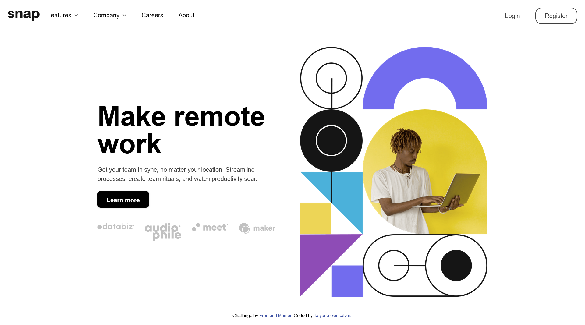

# <h1 align="center">Intro section with dropdown navigation</h1>

Projeto do <a href="https://www.frontendmentor.io/">Frontend Mentor</a>.

## Ferramentas Utilizadas
- React
- Tailwind
- HTML

## Funcionalidades
- Visualizar os menus suspensos relevantes no desktop e no celular ao interagir com os links de navegação
- Ver o layout ideal para o conteúdo dependendo do tamanho da tela do dispositivo
- Ver os estados de foco para todos os elementos interativos na página

## Como executar
No diretório do projeto, você pode executar:
`npm start`

Executa o aplicativo no modo de desenvolvimento.
Abra `http://localhost:3000` para visualizá-lo em seu navegador.

A página será recarregada quando você fizer alterações.
Você também pode ver erros de lint no console.

[Ou clique aqui e será direcionado ao site ativo.](https://dropdown-website.netlify.app/)

## Personalização
Esse projeto pode ser personalizado para diversos fins.

## Autor
Este projeto foi desenvolvido por Tatyane Gonçalves.